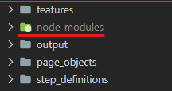
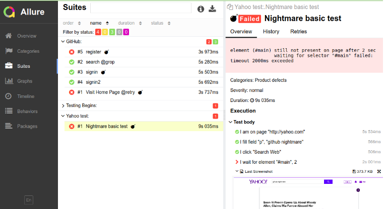

<h1  align="center"> NightOwl :owl:</h1>

<p align="center">NightOwl is a web automation based on 
 <a href="https://github.com/estrategiahq/desafio-qa-engineer">QA Enginner Challenge</a> instructions with BDD feature and PageObject implementation.</p>

<p align="center">
 <a href="#getting-started">Getting Started</a> |
 <a href="#prerequisites">Prerequisites</a> | 
 <a href="#running-the-tests-testing-feature-scenarios">Running Feature</a> | 
 <a href="#running-the-tests-testing-tagged-scenario">Running Tagged Scenario</a> | 
 <a href="#allure-reporter">Allure reporter</a> | 
 <a href="#built-with">Built with</a> |
 <a href="#author">Author</a>
</p>

## Getting Started

You can clone the project in your local machine or download the zipped main file and unzip in a folder of your choice. 
> To clone this project, execute these prompt commands:

```
    cd path/target/
    git clone https://github.com/plenissima/qa-engineer-challenge.git
```


### Prerequisites

Before downloaded the main version of the project, make sure you have [Node.js](https://nodejs.org/en/about/) installed. Execute the following command to verify nodeJs version:

```
    npm -v
    6.14.10
```
after
```
    npm install
```

To install all the dependencies defined in the **package.json** file, generating a **node_modules** folder. 

 

The allure-commandline package (Allure reporter) requires [Java 8](https://www.oracle.com/br/java/technologies/javase/javase-jdk8-downloads.html),
verify the Java version installed in your machine run in the prompt the command:

```
    java --version
```


## Running the tests: testing feature scenarios

Once installed all prerequisites, to run all feature scenarios execute the npm command:

```
    npm run features
```

> :information_source:  Or the codeceptjs equivalente command `npx codeceptjs run --steps --verbose` 


## Running the tests: testing tagged scenario

The **search_and_view.feature** has 4 scenarios with automation implementation.

Scenario | Tag
------------ | -------------
 Pesquisar Por professor: cursos da Professora Ena Loiola     | @search_teacher
 Pesquisar Por Cuncurso: Polícia Militar de São Paulo (PM-SP) | @search_contest
 Pesquisar Por Matéria: Direito Civil                         | @search_subject
 CURSOS ONLINE PARA CONCURSOS: Ver Todos                      | @view_all


To run them individually, just change the scenario tag:

```
    npx codeceptjs run --grep "@scenario_tagged"
```


## Allure reporter

 
By default, allure reports are saved to output directory. Launch Allure server and see the report like on a screenshot above:

```
    allure serve output
```


## Built With

* [CodeceptJs](https://codecept.io/) -is a SuperCharged End 2 End Testing with WebDriver & Puppeteer
* [WebdriverIO](https://webdriver.io/)- is a Browser and mobile automation test framework for Node.js
* [Selenium-Standalone-Service](https://www.npmjs.com/package/@wdio/selenium-standalone-service) - is a Standalone server to enable local browser testing.
* [Node.js](https://nodejs.org/en/) - is a JavaScript runtime built on Chrome's V8 JavaScript engine
* [Allure reporter](https://docs.qameta.io/allure/) - is a flexible lightweight multi-language test report tool


## Author

:runner:    Learning while doing

:mag_right: Find out more about me:

[](https://www.linkedin.com/in/gabrielg-pinheiro/)

Thank you!
